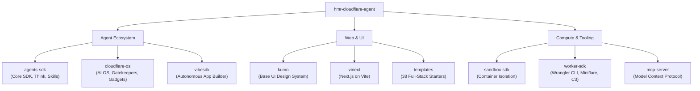

# Cloudflare Agentic AI Suite

A comprehensive workspace unifying Cloudflare''s next-generation AI agent frameworks, developer toolchains, container sandboxes, and modern web application platforms.

---

## Workspace Modules

---

## Module Overview

| Subsystem | Description | Quick Links |
| :--- | :--- | :--- |
| **[agents-sdk](./agents-sdk/)** | Core Cloudflare Agents framework: `Agent<Env, State>`, SQLite persistence, `@cloudflare/think`, `@cloudflare/codemode`, `@cloudflare/voice`, 55 runnable examples, and architectural RFCs. | [README](./agents-sdk/skill/README.md) · [Index](./agents-sdk/skill/index.md) |
| **[cloudflare-os](./cloudflare-os/)** | Enterprise AI operating system. Features the Gatekeeper security framework, sandboxed app development ("gadgets"), collaborative workspaces, and blueprints. | [README](./cloudflare-os/README.md) · [Index](./cloudflare-os/index.md) |
| **[kumo](./kumo/)** | Cloudflare''s accessible, design-system-compliant UI component library built on Base UI with semantic tokens and CSS Modules. | [README](./kumo/README.md) · [Index](./kumo/index.md) |
| **[sandbox-sdk](./sandbox-sdk/)** | Isolated Linux container execution inside Workers. Enables agents to run arbitrary commands, scripts, Jupyter notebooks, and background processes safely. | [README](./sandbox-sdk/README.md) · [Index](./sandbox-sdk/index.md) |
| **[templates](./templates/)** | 38 production-ready starter templates for full-stack apps, AI agents, D1, Hyperdrive, KV, R2, and microservices on Workers. | [README](./templates/README.md) · [Index](./templates/index.md) |
| **[vibesdk](./vibesdk/)** | Open-source agentic platform for building and deploying full-stack web applications via interactive model-and-tool loops. | [README](./vibesdk/README.md) · [Index](./vibesdk/index.md) |
| **[vinext](./vinext/)** | Reimplementation of the Next.js API surface (App Router, Pages Router, RSC, Server Actions) on Vite for Cloudflare Workers. | [README](./vinext/README.md) · [Index](./vinext/index.md) |
| **[worker-sdk](./worker-sdk/)** | Cloudflare''s official developer toolchain monorepo: Wrangler CLI, Miniflare simulator, Create-Cloudflare (C3), and Vite/Vitest plugins. | [README](./worker-sdk/README.md) · [Index](./worker-sdk/index.md) |
| **[mcp-server.md](./mcp-server.md)** | Specifications and connection endpoints for Cloudflare''s Model Context Protocol (MCP) servers across all product areas. | [Guide](./mcp-server.md) |

---

## Getting Started

### Prerequisites
- **Node.js**: Version 18.0 or later (Node 22+ recommended)
- **Package Manager**: [pnpm](https://pnpm.io/) (v9+)
- **Cloudflare Account**: [Sign up for free](https://dash.cloudflare.com/sign-up) with Workers enabled
- **Docker**: Optional, required only for local container testing with `sandbox-sdk`

### Running Applications
To explore and run individual components, navigate to the respective directory and follow its README instructions.

For a full directory index and documentation catalog, see **[index.md](./index.md)**.
